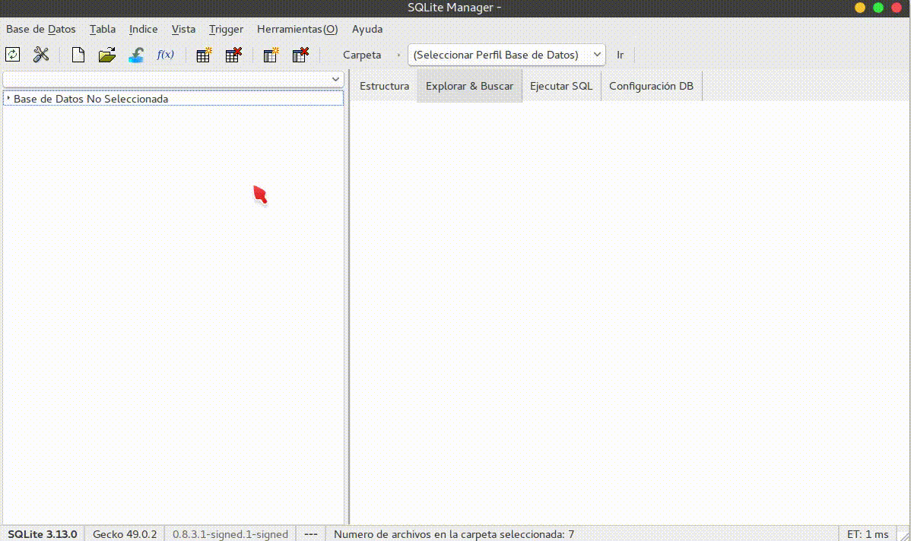

# Seman 5: Base de Datos con SQlite
> - Manejo de Base Datos SQlite: 
> - MVP (Modelo Vista Presentador)

## Enunciado del Ejercicio
- Tomando como punto de partida la funcionalidad que generaste para mostrar las ultimas 5 mascotas, es momento de dar persistencia a esta información.

- Estas 5 mascotas estarán cambiando conforme el usuario da rating a una o varias, mascotas. En el POJO que estas manejando para la entidad mascota genera un identificador el cuál deberá ser único y te permita diferenciar una mascota de otra.

- Crea un modelo de base de datos que contenga una tabla llamada mascota esta debe ser idéntica al POJO de mascota, de tal forma que cuando una persona de rating a una foto puedas guardar los datos completos de la entidad en la base de datos. Para fines de este ejercicio tu tabla solo estará guardando las últimas 5 mascotas con rating.

## Descripción del proyecto:
- Acontinuacion describiré de forma brebe mi trabajo:

### 1. Crear un nuevo paquete a la entidad mascota.
- Para representarla se crea un nuevo paquete Java con el nombre "db". Dentro de este, se añade una clase llamada BaseDatos, ConstructorMascota y ConstantesBaseDatos.
- Cuyos atributos son:
> - id
> - nombre
> - foto
> - likes

- Para empezar modificamos el Pojo añadiento el id 
#### Java: Pojo del proyecto
````java
public class Mascota implements Serializable{
    private int id;
    private String nombreMascota;
    private int foto;
    private int likes;
}
````

#### Se crea una clase ConstantesBaseDatos.
- Se añade dentro del paquete "db" una nueva clase llamada ConstantesBaseDatos.java que define una clase interna con los datos de la tabla "mascota" que se creará en la base de datos.

#### ConstantesBaseDatos.java
````java

public final class ConstantesBaseDatos {

    public static final String DATABASE_NAME = "mascotas";
    public static final int DATABASE_VERSION = 1;

    public static final String TABLE_MASCOTAS = "mascota";
    public static final String TABLE_MASCOTAS_ID = "id";
    public static final String TABLE_MASCOTAS_NOMBRE = "nombre";
    public static final String TABLE_MASCOTAS_FOTO = "foto";
    public static final String TABLE_MASCOTAS_LIKES = "likes";
}
````

### Crear BaseDatos.java que extienda de SQliteOpenHelper.

- SQLiteOpenHelper nos permitirá comunicar nuestra aplicación con la base de datos. Se trata de una clase abstracta que nos provee los mecanismos básicos para la relación entre la aplicación Android y la información.
- Para implementar este controlador se debe:

>- Crear una clase que extienda de SQLiteOpenHelper
>- Configurar un constructor apropiado
>- Sobrescribir los métodos onCreate() y onUpgrade()

### Crear BaseDatos.java

- Crear una nueva clase BaseDatos.java que extienda de SQLiteOpenHelper. El constructor BaseDatos usa super para mantener la herencia del helper.
```java
public class BaseDatos extends SQLiteOpenHelper {
    // Variable Global
    private Context context;

    public BaseDatos(Context context) {
        super(context, ConstantesBaseDatos.DATABASE_NAME, null, ConstantesBaseDatos.DATABASE_VERSION);
        this.context = context;
    }
}
```
### Código SQL para crear una base de datos
- Una vez terminado el esquema, crear la tabla de mascotas en onCreate() con el metodo execSQL() y el comando CREATE TABLE:
```java
public void onCreate(SQLiteDatabase db) {
        // Se crea la estructura de la Base de Datos de la tabla
        String queryCrearTablaMascota = "CREATE TABLE " + ConstantesBaseDatos.TABLE_MASCOTAS  + " ("+
                                        ConstantesBaseDatos.TABLE_MASCOTAS_ID       + " INTEGER PRIMARY KEY AUTOINCREMENT NOT NULL UNIQUE," +
                                        ConstantesBaseDatos.TABLE_MASCOTAS_NOMBRE   + " TEXT NOT NULL," +
                                        ConstantesBaseDatos.TABLE_MASCOTAS_FOTO     + " INTEGER NOT NULL," +
                                        ConstantesBaseDatos.TABLE_MASCOTAS_LIKES    + " INTEGER NOT NULL DEFAULT 0" +
                                        " )";

        db.execSQL (queryCrearTablaMascota);
        if (validaExistenciaTabla(db)){
            insertarDatosIniciales(db);
        }
    }
```
### Insertar Información En La Base De Datos
- El método cuya funcionalidad es añadir filas a nuestras tablas se llama SQLiteDatabase.insert().

> - La receta a seguir para usarlo es:
> - 1. Crea un objeto del tipo ContentValues. Este permite almacenar las columnas del registro en pares clave-valor
> - 2. Añadir los pares con el método put()
> - 3. Invocar a insert() a través de la instancia de la base de datos

```java
 public void insertarDatosIniciales(SQLiteDatabase db){

        ContentValues contentValues = new ContentValues();
        contentValues.put(ConstantesBaseDatos.TABLE_MASCOTAS_NOMBRE, "Muñeco");
        contentValues.put(ConstantesBaseDatos.TABLE_MASCOTAS_FOTO, R.drawable.mascota_19_2);
        db.insert(ConstantesBaseDatos.TABLE_MASCOTAS, null, contentValues);

        contentValues.put(ConstantesBaseDatos.TABLE_MASCOTAS_NOMBRE, "Laica");
        contentValues.put(ConstantesBaseDatos.TABLE_MASCOTAS_FOTO, R.drawable.mascota_19_3);
        db.insert(ConstantesBaseDatos.TABLE_MASCOTAS, null, contentValues);

        contentValues.put(ConstantesBaseDatos.TABLE_MASCOTAS_NOMBRE, "Petrolero");
        contentValues.put(ConstantesBaseDatos.TABLE_MASCOTAS_FOTO, R.drawable.mascota_19_4);
        db.insert(ConstantesBaseDatos.TABLE_MASCOTAS, null, contentValues);

        contentValues.put(ConstantesBaseDatos.TABLE_MASCOTAS_NOMBRE, "Valvula");
        contentValues.put(ConstantesBaseDatos.TABLE_MASCOTAS_FOTO, R.drawable.mascota_19_5);
        db.insert(ConstantesBaseDatos.TABLE_MASCOTAS, null, contentValues);

        contentValues.put(ConstantesBaseDatos.TABLE_MASCOTAS_NOMBRE, "Gordo");
        contentValues.put(ConstantesBaseDatos.TABLE_MASCOTAS_FOTO, R.drawable.mascota_19_6);
        db.insert(ConstantesBaseDatos.TABLE_MASCOTAS, null, contentValues);

        contentValues.put(ConstantesBaseDatos.TABLE_MASCOTAS_NOMBRE, "Mariposa");
        contentValues.put(ConstantesBaseDatos.TABLE_MASCOTAS_FOTO, R.drawable.mascota_19_7);
        db.insert(ConstantesBaseDatos.TABLE_MASCOTAS, null, contentValues);

        contentValues.put(ConstantesBaseDatos.TABLE_MASCOTAS_NOMBRE, "Campeón");
        contentValues.put(ConstantesBaseDatos.TABLE_MASCOTAS_FOTO, R.drawable.mascota_19_8);
        db.insert(ConstantesBaseDatos.TABLE_MASCOTAS, null, contentValues);

        contentValues.put(ConstantesBaseDatos.TABLE_MASCOTAS_NOMBRE, "Dumbo");
        contentValues.put(ConstantesBaseDatos.TABLE_MASCOTAS_FOTO, R.drawable.mascota_19_9);
        db.insert(ConstantesBaseDatos.TABLE_MASCOTAS, null, contentValues);

        contentValues.put(ConstantesBaseDatos.TABLE_MASCOTAS_NOMBRE, "Chimbo");
        contentValues.put(ConstantesBaseDatos.TABLE_MASCOTAS_FOTO, R.drawable.mascota_19_10);
        db.insert(ConstantesBaseDatos.TABLE_MASCOTAS, null, contentValues);

        contentValues.put(ConstantesBaseDatos.TABLE_MASCOTAS_NOMBRE, "Lasi");
        contentValues.put(ConstantesBaseDatos.TABLE_MASCOTAS_FOTO, R.drawable.mascota_19_11);
        db.insert(ConstantesBaseDatos.TABLE_MASCOTAS, null, contentValues);
    }
```
### Sobrescribe el método onUpgrade().

- Este es ejecutado si se identificó que el usuario tiene una versión antigua de la base de datos. En su interior establecerá instrucciones para modificar el esquema de la base de datos, como por ejemplo eliminar todo el esquema y recrearlo, agregar una nueva tabla, añadir una nueva columna, etc.

```java
 public void onUpgrade(SQLiteDatabase db, int oldVersion, int newVersion) {
        db.execSQL("DROP TABLE IF EXIST " + ConstantesBaseDatos.TABLE_MASCOTAS);
        onCreate(db);
 }
```
### Resultado


### Crear un manejador de Datos:
- Esta clase se encargara de obtener los datos de las mascotas y los likes de cada mascota 
```java
public class ConstructorMascotas {

    private Context context;
    private BaseDatos baseDatos;

    public ConstructorMascotas(Context context) {
        this.context = context;
        this.baseDatos = new BaseDatos(this.context);
    }

    // Metodo obtener los datos

    public ArrayList<Mascota> obtenerTodasMascotas(){
        ArrayList<Mascota> mascotas;
        String query = "SELECT * FROM " + ConstantesBaseDatos.TABLE_MASCOTAS;
        SQLiteDatabase db = this.baseDatos.getWritableDatabase();
        Cursor registros = db.rawQuery(query, null);
        mascotas = deRegistrosAMascotas(registros);
        db.close();
        return mascotas;
    }


    public ArrayList<Mascota> obtener5MejoresMascotas(){
        ArrayList<Mascota> mascotas;
        String query = "SELECT * FROM "+ ConstantesBaseDatos.TABLE_MASCOTAS +" ORDER BY "+ ConstantesBaseDatos.TABLE_MASCOTAS_LIKES +" DESC LIMIT 5";
        SQLiteDatabase db = this.baseDatos.getWritableDatabase();
        Cursor registros = db.rawQuery(query, null);
        mascotas = deRegistrosAMascotas(registros);
        db.close();
        return mascotas;
    }

    private ArrayList<Mascota> deRegistrosAMascotas(Cursor registros){
        ArrayList<Mascota> mascotas = new ArrayList<>();
        while(registros.moveToNext()){
            Mascota mascotaActual = new Mascota();
            mascotaActual.setId(registros.getInt(0));
            mascotaActual.setNombreMascota(registros.getString(1));
            mascotaActual.setFoto(registros.getInt(2));
            mascotaActual.setLikes(registros.getInt(3));
            mascotas.add(mascotaActual);
        }
        return mascotas;
    }

    public void likesMascota(Mascota mascota){
        SQLiteDatabase db = this.baseDatos.getWritableDatabase();

        String queryActualizarPuntajeTablaMascota = "UPDATE " + ConstantesBaseDatos.TABLE_MASCOTAS +
                " SET " + ConstantesBaseDatos.TABLE_MASCOTAS_LIKES + " = " + ConstantesBaseDatos.TABLE_MASCOTAS_LIKES + "+1 " +
                "WHERE " + ConstantesBaseDatos.TABLE_MASCOTAS_ID + "=" + Integer.toString(mascota.getId());

        db.execSQL(queryActualizarPuntajeTablaMascota);

        String query = "SELECT * FROM " + ConstantesBaseDatos.TABLE_MASCOTAS + " WHERE " + ConstantesBaseDatos.TABLE_MASCOTAS_ID + " = " + mascota.getId();
        Cursor dato_mascota = db.rawQuery(query, null);
        if (dato_mascota.moveToNext()){
            mascota.setLikes(dato_mascota.getInt(3));
        }

        db.close();
    }

}
```
### Acontinuacion muestro los atributos de mascotas usando el SQlite Manager de FireFox.

